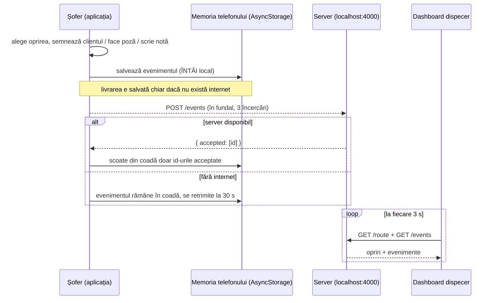

# Cum funcționează proiectul

Proiectul are trei părți care lucrează împreună:

| Parte | Folder | Pentru cine | Ce face |
| --- | --- | --- | --- |
| **Aplicația mobilă** | `App.tsx`, `src/` | șoferul / curierul | vede ruta zilei, confirmă livrarea (integral, parțial, refuzat) cu semnătură, poză și notă, **chiar fără internet** |
| **Serverul** | `server/` | sistemul | primește evenimentele de livrare, le păstrează și le dă mai departe |
| **Dashboard-ul** | `dashboard/` | dispecerul | vede live pe calculator ce s-a livrat, unde și cu ce dovadă |

Capturi de ecran de pe un telefon real: vezi secțiunea **[Capturi de ecran din README](README.md#capturi-de-ecran-iphone-expo-go)**.

## Drumul unei livrări



Pe scurt:

1. **Salvarea nu așteaptă niciodată rețeaua.** Când șoferul apasă un buton, evenimentul se scrie mai întâi în memoria telefonului. Abia apoi aplicația încearcă să-l trimită.
2. **Sincronizarea e sigură.** Din coada locală se șterg doar evenimentele pe care serverul le-a confirmat (`accepted`). Dacă cererea eșuează la jumătate, restul evenimentelor rămân pe telefon.
3. **Serverul nu dublează nimic.** Fiecare eveniment are un `id` unic. Dacă același eveniment e trimis de două ori, de exemplu după o conexiune pierdută, serverul îl păstrează o singură dată.
4. **Dashboard-ul** citește serverul la fiecare 3 secunde și arată starea fiecărei opriri după ultimul ei eveniment.

## Aplicația mobilă

- **Ruta zilei:** trei opriri demo, cu progresul (`1/3`) și un contor de evenimente care n-au ajuns încă la server.
- **Ecranul livrării:** comanda, adresa, nota, blocul **Dovada livrării** și trei butoane.
- **Regulile pentru dovadă** (`src/proof/rules.ts`). Butonul rămâne dezactivat până e îndeplinită regula:

  | Rezultat | Ce trebuie |
  | --- | --- |
  | Livrat integral | semnătura clientului |
  | Livrat parțial | semnătura **și** o notă cu ce a lipsit |
  | Refuzat | o poză **sau** o notă cu motivul (clientul care refuză nu semnează) |

- **Semnătura** (`src/proof/SignaturePad.tsx`) se desenează cu degetul (`react-native-svg`) și se salvează ca text: `{"w":300,"h":170,"d":"M10 10 L200 120 ..."}`, adică o cale SVG. Așa se poate trimite la server și desena înapoi în dashboard.
- **Poza** (`src/proof/PhotoProof.tsx`) se face cu camera (`expo-image-picker`). Pe telefon se păstrează calea locală a fișierului, iar pe web imaginea ca text base64.
- **Sincronizarea** (`src/sync.ts`):
  - pornește în fundal după fiecare salvare, la fiecare 30 s cât timp există evenimente în așteptare, și manual când apeși pe contorul din header;
  - fiecare cerere are un timeout de 5 s, cu 3 încercări și o pauză tot mai mare între ele;
  - la pornire, aplicația arată imediat datele locale, apoi încearcă să ia ruta de la server (`GET /route`). Dacă nu reușește, rămâne pe opririle locale.
- **Adresa serverului** se setează cu variabila `EXPO_PUBLIC_API_URL` (implicit `http://localhost:4000`):
  - emulator Android: `http://10.0.2.2:4000`;
  - telefon real: `http://<IP-ul calculatorului>:4000`, cu telefonul și calculatorul în aceeași rețea Wi-Fi.

### Evenimentul de livrare (contractul comun)

Aplicația, serverul și dashboard-ul folosesc toate exact această formă (`src/types.ts`):

```ts
{
  id: string;          // "event-<timp>-<aleator>", unic
  stopId: string;      // "stop-1"
  status: 'delivered' | 'partial' | 'refused';
  note: string;
  createdAt: string;   // ISO, ex. "2026-09-29T19:00:00.000Z"
  proof?: { photoUri?: string; signature?: string };
}
```

## Serverul (`server/`)

Serverul e scris în Node + Express. Nu folosește bază de date: evenimentele se salvează în `server/data/events.json`, scris atomic (întâi un fișier temporar, apoi redenumit).

| Cerere | Răspuns |
| --- | --- |
| `GET /health` | `{ ok: true }` |
| `GET /route` | cele 3 opriri ale zilei |
| `POST /events` cu `{ events: [...] }` | `{ accepted: [id-uri] }`. Un id deja primit nu se dublează, iar datele greșite (status invalid, fără `id` / `stopId`) primesc `400` |
| `GET /events` | tot istoricul, cele mai noi primele |
| `GET /status` | ultimul eveniment al fiecărei opriri |
| `/dashboard` | pagina dispecerului |

## Dashboard-ul (`dashboard/`)

Dashboard-ul e o pagină web simplă (HTML + CSS + JavaScript), fără build.

- **Indicatori:** câte opriri sunt gata, câte livrări sunt integrale, parțiale și refuzate, și valoarea livrată în MDL.
- **Fiecare oprire** arată ultimul ei eveniment: statusul, ora, nota, semnătura desenată și un semn dacă are poză atașată.
- **Fluxul live** de evenimente evidențiază ce a sosit nou.
- **Indicatorul de conexiune** arată *Online* sau *Offline* și ora ultimei actualizări.
- **Mod demo** (`?demo=1`): arată date fictive care apar treptat. E util la prezentare, fără server.
- Are temă luminoasă și întunecată și se vede bine și pe telefon.

## Cum pornești tot (demo complet)

Ai nevoie de trei terminale:

```bash
# 1. serverul
cd server && npm install && npm start      # http://localhost:4000

# 2. aplicația (în rădăcina proiectului)
npm install
EXPO_PUBLIC_API_URL=http://<IP-ul-tău>:4000 npx expo start

# 3. dashboard-ul: deschide în browser
#    http://localhost:4000/dashboard
```

Scenariul de prezentare:

1. Deschide dashboard-ul: toate opririle sunt „De livrat”.
2. În aplicație pune telefonul în **modul avion**, deschide o oprire, lasă clientul să semneze și apasă **Livrat integral**. Oprirea apare livrată în aplicație, iar contorul arată „1 offline”.
3. Dashboard-ul încă nu știe nimic, pentru că telefonul e offline.
4. Scoate telefonul din modul avion și apasă pe contor (sau așteaptă până la 30 s). În dashboard apare livrarea, cu semnătura.

Fără server și fără telefon: deschide `dashboard/index.html?demo=1` în browser.

## Structura fișierelor

```
App.tsx                  ecranele aplicației (ruta + livrarea)
src/types.ts             tipurile comune (Stop, DeliveryEvent)
src/queue.ts             logica cozii: creare eveniment, unul per oprire, progres
src/storage.ts           salvare/citire din AsyncStorage (rezistă la date corupte)
src/sync.ts              trimiterea la server cu reîncercări
src/proof/               semnătura, poza și regulile dovezii
__tests__/, src/__tests__/  teste Jest
server/                  backend-ul Express + testele lui
dashboard/               pagina dispecerului
.github/workflows/ci.yml verificarea automată pe GitHub
```

## Teste și verificare automată

```bash
npm test                 # 27 de teste: coada, memoria, fluxul complet în aplicație
npm run typecheck        # verificarea tipurilor TypeScript
cd server && npm test    # 6 teste pentru server: dubluri, validare, persistență
```

La fiecare `push` pe `main`, GitHub Actions rulează automat toate aceste verificări. Rezultatul se vede în insigna **CI** din README.

## Ce nu e făcut încă

- Poza nu se urcă pe server ca fișier. Se trimite doar calea locală de pe telefon, iar dashboard-ul arată doar că poza există.
- Nu există autentificare pentru șoferi și dispeceri.
- La conflicte, regula e simplă: ultimul eveniment al unei opriri câștigă.
- Pentru o versiune reală, serverul trebuie să meargă pe HTTPS.
