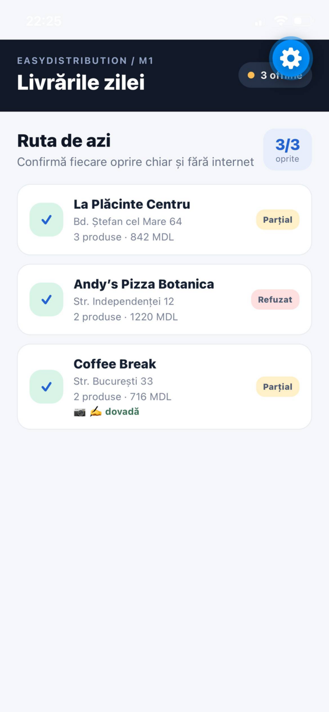
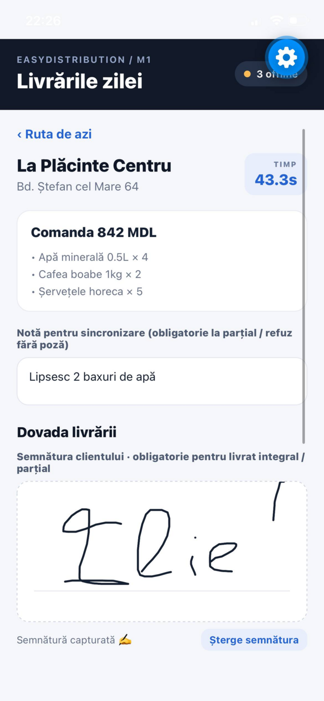
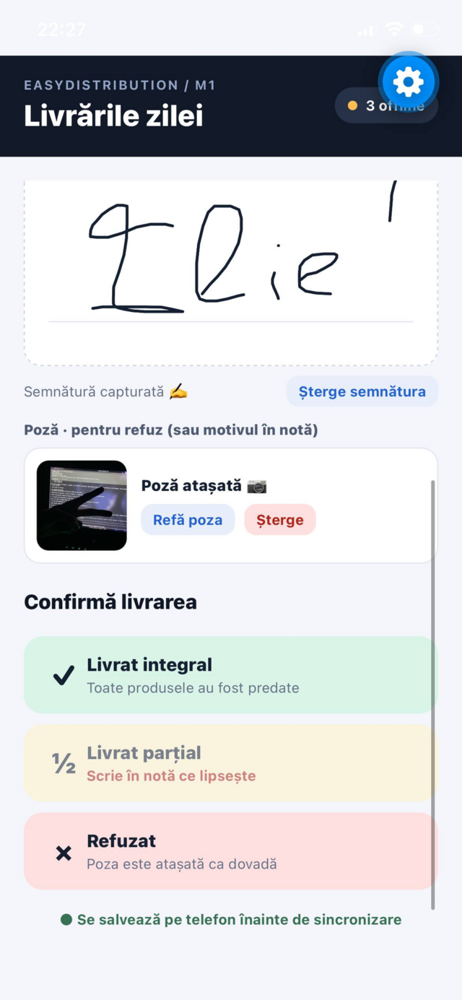
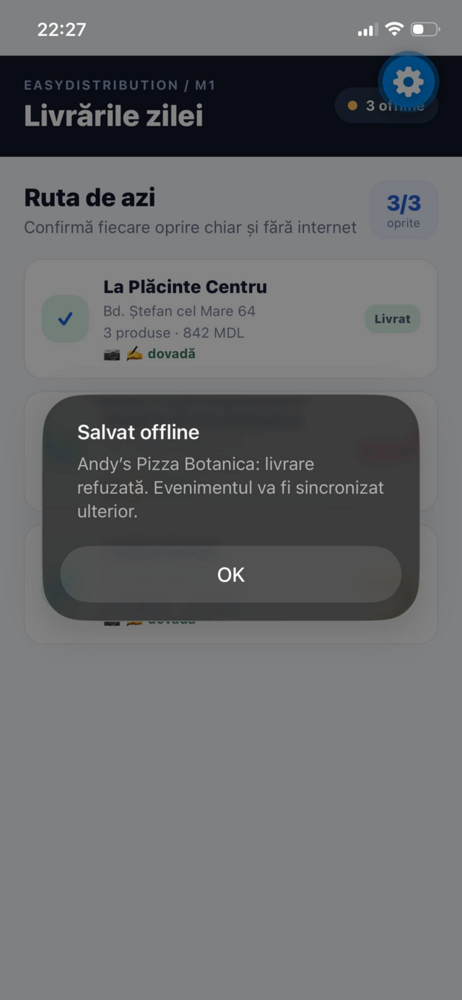
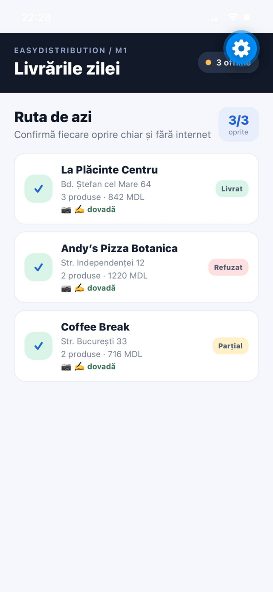

# Cornos Ilie - Mobile delivery proof

[](https://github.com/cs1lyuha/cornos-ilie-sales/actions/workflows/ci.yml)

Expo / React Native MVP for the individual mobile brief:

> Delivery confirmation screen that must work without internet.

📖 **[Cum funcționează (explicație completă în română)](CUM-FUNCTIONEAZA.md)**: aplicația, serverul, dashboard-ul, drumul unei livrări și scenariul de demo.

## Capturi de ecran (iPhone, Expo Go)

Un traseu complet, făcut pe un telefon real, cu toate cele trei livrări salvate offline:

<table>
  <tr>
    <td align="center" width="20%"></td>
    <td align="center" width="20%"></td>
    <td align="center" width="20%"></td>
    <td align="center" width="20%"></td>
    <td align="center" width="20%"></td>
  </tr>
  <tr>
    <td align="center"><b>1. Ruta de azi</b><br>opriri cu status și dovadă, contorul „offline” sus</td>
    <td align="center"><b>2. Livrarea</b><br>comanda, nota și semnătura clientului cu degetul</td>
    <td align="center"><b>3. Dovada</b><br>semnătură + poză; butoanele arată ce mai lipsește</td>
    <td align="center"><b>4. Salvat offline</b><br>evenimentul e pe telefon, se sincronizează ulterior</td>
    <td align="center"><b>5. Ruta gata</b><br>3/3: livrat, refuzat, parțial, toate cu 📷 ✍️</td>
  </tr>
</table>

## Construit cu 4 agenți AI în paralel

A doua iterație a proiectului a fost construită de **4 agenți Claude Code care au lucrat în același timp**. Fiecare a avut copia lui izolată a proiectului (git worktree) și branch-ul lui. Toți au primit de la început **același contract API și aceeași formă a evenimentului de livrare**, ca piesele să se potrivească la final. Cât agenții lucrau, eu am coordonat: am definit contractul, am unit branch-urile, am rezolvat conflictele și am verificat întregul sistem cap-coadă.

Au lucrat fiecare între 6 și 8 minute, toți în paralel, așa că totul a fost gata în **~8 minute în loc de ~27** cât ar fi durat unul după altul.

| Agent | Ce a făcut | Impactul |
| --- | --- | --- |
| 🛰️ **1. Backend & sincronizare** | Server Node + Express (`server/`) cu `/route`, `/events`, `/status`, salvare atomică pe disc și 6 teste. În aplicație, `src/sync.ts`: trimitere cu timeout, 3 reîncercări cu pauze tot mai mari și retrimitere automată la 30 s. | Sincronizarea **simulată** a devenit **reală**. Serverul nu dublează evenimentele (după `id`), iar de pe telefon se șterg doar cele confirmate de server, deci **nicio livrare nu se pierde**, nici cu internet instabil. |
| ✍️ **2. Dovada livrării** | Semnătura clientului desenată cu degetul (`react-native-svg`), poză cu camera (`expo-image-picker`), reguli pentru fiecare rezultat și mesaje de permisiune în română (`src/proof/`). | Confirmarea a devenit o **dovadă verificabilă**: fără semnătură nu se poate marca „Livrat integral”, iar un refuz cere o poză sau un motiv. Totul se salvează offline, în eveniment. |
| 🧪 **3. Teste & CI** | A mutat logica cozii în `src/queue.ts` și `src/storage.ts`, a configurat Jest + React Native Testing Library și GitHub Actions. | **27 de teste** pentru aplicație (plus cele 6 ale serverului) rulează automat la fiecare push. Datele corupte din memorie nu mai blochează aplicația, iar orice regresie se vede imediat în insigna **CI**. |
| 📊 **4. Dashboard dispecer** | Pagină web fără build (`dashboard/`), cu actualizare la 3 s, indicatori, stările opririlor, semnăturile desenate, flux live, temă luminoasă/întunecată și mod `?demo=1`. | Dispecerul **vede în timp real** ce se întâmplă pe traseu. E și cea mai bună piesă de demo: marchezi o livrare pe telefon și apare pe ecranul calculatorului. |

**Ce a scos la iveală integrarea.** Agenții au lucrat separat, așa că la unire au ieșit **5 probleme reale**, toate reparate:
- dovada se pierdea când lista de opriri venea de la server;
- două evenimente create în aceeași milisecundă puteau avea același id, iar serverul ar fi păstrat doar unul;
- testele vechi nu mai treceau după regula nouă cu semnătura;
- testele ar fi făcut apeluri reale la rețea;
- tipurile și salvarea erau duplicate între branch-uri.

Toate sunt descrise în [`AI-LOG.md`](AI-LOG.md#parallel-agents-practice-follow-up).

## Run in three commands

```bash
git clone https://github.com/cs1lyuha/cornos-ilie-sales.git
cd cornos-ilie-sales && npm install
npx expo start
```

Open the project in Expo Go or an Android emulator.

## What works

- Route-of-the-day list with delivery stops and progress.
- Delivery detail with order lines, value, and address.
- Three explicit outcomes: delivered in full, delivered partially, or refused.
- Optional note saved with the delivery event.
- Proof of delivery: customer signature and camera photo (see **Dovada livrării**).
- Every event is written to AsyncStorage before the UI leaves the delivery screen.
- The header shows pending offline events; tapping it syncs them to the backend (see below). Sync also runs in the background after each save and every 30 s while events are pending.
- The flow works with airplane mode enabled because the delivery decision does not require a network request.

## Demo data

The brief did not include an API, authentication, database schema, or real catalog. The app therefore uses three local stops and a local event queue. Queue logic lives in `src/queue.ts` and persistence in `src/storage.ts`; the future API adapter should build on them while preserving this event shape:

```ts
{
  id: string;
  stopId: string;
  status: 'delivered' | 'partial' | 'refused';
  note: string;
  createdAt: string;
  proof?: { photoUri?: string; signature?: string };
}
```

## Teste

```bash
npm test            # Jest (jest-expo) + React Native Testing Library
npm run typecheck   # tsc --noEmit
```

- `src/__tests__/queue.test.ts` - pure queue logic (`src/queue.ts`): event creation, one current event per stop, applying events to stops, route progress.
- `src/__tests__/storage.test.ts` - AsyncStorage wrapper (`src/storage.ts`), including corrupted or unreadable data.
- `__tests__/App.test.tsx` - the full flow: open a stop, add a note, confirm, check status, offline counter, stored event and reload after re-mount.

CI (`.github/workflows/ci.yml`) runs `npm ci`, the typecheck and the tests on every push and pull request to `main`.

## Backend & sync

`server/` is a small standalone Node + Express backend (no database, events persist to `server/data/events.json`).

```bash
cd server && npm install
npm start          # http://localhost:4000 (override with PORT=...)
npm test           # node --test smoke tests: idempotency + validation
```

API: `GET /health`, `GET /route` (the 3 demo stops), `POST /events` with `{ events: DeliveryEvent[] }` → `{ accepted: string[] }` (idempotent by event `id`, 400 on invalid status / missing id / stopId), `GET /events` (full history, newest first), `GET /status` (latest event per stop). If a `dashboard/` folder exists it is served at `/dashboard`.

The app sync lives in `src/sync.ts`: it POSTs the local queue with a 5 s timeout and 3 attempts (exponential backoff), removes only the ids the server accepted and keeps everything else on the phone. Saving a delivery never waits for the network. On start the app loads `GET /route` and falls back to the local demo stops when offline.

Point the app at the server with `EXPO_PUBLIC_API_URL` (default `http://localhost:4000`), e.g. `EXPO_PUBLIC_API_URL=http://192.168.1.20:4000 npx expo start`, or put it in a `.env` file:

- iOS simulator / web: `http://localhost:4000`
- Android emulator: `http://10.0.2.2:4000` (the emulator's alias for the PC)
- Real phone (Expo Go): `http://<PC LAN IP>:4000` on the same Wi-Fi; allow port 4000 in the PC firewall.

Restart Expo after changing the variable (it is inlined at bundle time). Plain `http` is fine for local development; a production build should use HTTPS.

## Verification path

1. Start the app.
2. Open any stop.
3. Turn on airplane mode.
4. Let the customer sign in the signature box, then tap **Livrat integral**.
5. Return to the route: the stop remains marked as delivered and shows the ✍️ marker.
6. Start the server (`cd server && npm start`), turn airplane mode off and tap the offline counter: the alert reports how many events were synced.

## Dovada livrării

The delivery screen has a **Dovada livrării** block with a signature pad and a **Fă o poză** button.

| Outcome | Required before the button is enabled |
| --- | --- |
| Livrat integral | customer signature |
| Livrat parțial | customer signature **and** a note saying what was missing |
| Refuzat | a photo **or** a note with the reason (a refusing customer will not sign) |

Buttons stay disabled until their rule is satisfied, and each button shows an inline hint with what is missing.

- **Signature** (`src/proof/SignaturePad.tsx`): drawn with `react-native-svg` + `PanResponder`, no WebView. Stored as a JSON string `{"w":number,"h":number,"d":string}` where `d` is an SVG path in pad pixels, so a server or dashboard can render it with `<svg viewBox="0 0 w h"><path d="…" fill="none" stroke="#000"/></svg>`. **Șterge semnătura** clears it.
- **Photo** (`src/proof/PhotoProof.tsx`): `expo-image-picker` camera at quality 0.5, with retake/remove. If camera permission is denied, or no camera is available (simulator), the screen explains it and the driver can use the note instead. On web the photo is kept as a data URI only if it is small enough for browser storage.
- **Offline**: the proof is written to AsyncStorage inside the delivery event before the screen closes, together with the status and note. Route stops with proof show a `📷` / `✍️` marker.
- Camera permission text (Romanian) is set through the `expo-image-picker` plugin in `app.json`; microphone permission is disabled. A new native build is needed for the permission text to apply (Expo Go uses its own).
- Known limit: on native, `photoUri` is a local `file://` path in the app cache. The sync step must upload the file itself; copying it into permanent storage (`expo-file-system`) is a follow-up.

## Dashboard dispecer

`dashboard/` is a live web view for the dispatcher (vanilla HTML/CSS/JS, no build step, UI in Romanian).

- **With the server:** open `http://localhost:4000/dashboard` — the API is read from the same origin.
- **Without the server (demo):** open `dashboard/index.html?demo=1` (or `http://localhost:4000/dashboard/?demo=1`); built-in fake events arrive over the first ~15 s, and the banner can simulate a lost connection or restart the scenario.
- **Another API host:** `dashboard/index.html?api=http://192.168.1.20:4000`, or set it under **Setări** (stored in `localStorage`). Opened as a local file without `?api`, it defaults to `http://localhost:4000`, which requires CORS on the server.

It polls `GET /route` and `GET /events` every 3 s and shows: a connection indicator with the last update time; KPIs (stops done / total, delivered / partial / refused, value delivered in full plus partial value in MDL); every stop with its latest event (status chip with icon + text, time, note, signature thumbnail, `📷 poză atașată` badge); and a live feed of events, newest first, with new ones highlighted. Light and dark follow `prefers-color-scheme`.

## Scope boundary

Still out of scope: authentication, uploading the photo file itself during sync, and server conflict resolution beyond "latest event per stop wins".

The delivery event contract is:

```ts
{
  id: string;
  stopId: string;
  status: 'delivered' | 'partial' | 'refused';
  note: string;
  createdAt: string;
  proof?: { photoUri?: string; signature?: string };
}
```
